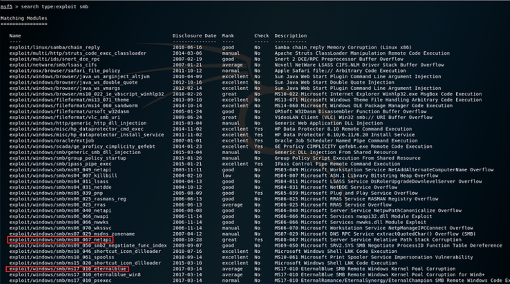

# API Passive Reconnaissance

## Setting Up Tools

To conduct effective API security testing using Kali Linux, follow these steps to set up essential tools and practice environments:

**Tools Installation**

1. **Burp Suite Community Edition**: Crucial for API security assessments.
   * [Download Burp Suite](https://portswigger.net/burp/communitydownload)
2. **Postman**: Essential for API development and testing.
   * [Download Postman](https://www.postman.com/downloads/)
3. **FoxyProxy Standard**: Firefox extension for managing proxies during testing.
   * [Install FoxyProxy](https://addons.mozilla.org/en-US/firefox/addon/foxyproxy-standard/)
4. **Docker**: Useful for running vulnerable API environments in isolated containers.
   *   Install Docker:

       ```bash
       $ sudo apt-get install docker.io docker-compose
       ```
5. **Go Programming Language**: Required for certain security tools.
   *   Install Go:

       ```bash
       $ sudo apt install golang-go
       ```
6. **Git**: Version control system for managing repositories.
   *   Install Git:

       ```bash
       $ sudo apt-get install git
       ```

**API Hacking Lab Setup**

1. **crAPI**: Vulnerable API application.
   * GitHub: [crAPI](https://github.com/OWASP/crAPI)
   *   Local Setup:

       ```bash
       $ mkdir ~/lab && cd ~/lab
       $ sudo curl -o docker-compose.yml https://raw.githubusercontent.com/OWASP/crAPI/main/deploy/docker/docker-compose.yml
       $ sudo docker-compose pull
       $ sudo docker-compose -f docker-compose.yml --compatibility up -d
       ```
   * Access locally: [http://127.0.0.1:8888](http://127.0.0.1:8888)
2. **vAPI**: Another vulnerable API application.
   * GitHub: [vAPI](https://github.com/roottusk/vapi)
   *   Local Setup:

       ```bash
       $ cd ~/lab
       $ sudo git clone https://github.com/roottusk/vapi.git
       $ cd vapi
       $ sudo docker-compose up -d
       ```
   * Access locally: [http://127.0.0.1/vapi](http://127.0.0.1/vapi)
   * Postman Collection: Import from `vAPI/postman`

**Additional Resources**

* **Portswigger Web Security Academy**: Learn about common API vulnerabilities.
  * [Web Security Academy](https://portswigger.net/web-security)
* **TryHackMe**: Practice API security in a hands-on lab environment.
  * [TryHackMe](https://tryhackme.com/)
* **HackTheBox**: Test your skills with API security challenges.
  * [HackTheBox](https://www.hackthebox.eu/)

**GitHub Vulnerable Apps**

Explore these GitHub repositories for more API security testing opportunities:

* [Pixi](https://github.com/syxz/pixi)
* [REST API Goat](https://github.com/squaresLab/REST-API-Goat)
* [DVWS-node](https://github.com/snoopysecurity/dvws-node)
* [Websheep](https://github.com/samyk/websheep)

**Conclusion**

By setting up these tools and labs, you'll be equipped to perform comprehensive API security assessments using Kali Linux. Regularly practice and explore additional resources to enhance your skills and stay updated with the latest API security trends.

## Introduction to API Reconnaissance

Before targeting APIs, understanding their existence and structure is crucial. This module covers techniques to uncover the API attack surface of a target through passive and active reconnaissance.

### **API Types and Accessibility**

APIs vary in accessibility based on their intended usage:

* **Public APIs**: Meant for end-users, these are typically well-documented and easy to find. They may or may not require authentication, depending on data sensitivity.
* **Partner APIs**: Exclusive to partners, these APIs are less publicly visible and may have limited documentation accessible only to partners.
* **Private APIs**: Internal to organizations, these APIs are the least documented and often require reverse engineering to understand.

### **Identifying Web API Indicators**

Discovering APIs involves looking for specific indicators:

* **URL Patterns**: Common URLs like `/api`, `/v1`, `/docs`, `/rest`, etc., often denote API endpoints.
  * Example: `https://target-name.com/api/v1`
* **Subdomains**: Subdomains like `api.target-name.com` or `dev.target-name.com` can indicate API endpoints.
* **HTTP Headers**: Look for `Content-Type: application/json` or `application/xml` in request and response headers.
* **Error Messages**: Responses such as `{"message": "Missing Authorization token"}` indicate potential API endpoints.

### **External Sources for API Discovery**

Explore external repositories and directories:

* **GitHub**: Search for APIs and related documentation.
  * [GitHub APIs](https://github.com/)
* **Postman Explore**: Browse a collection of APIs for testing and development.
  * [Postman Explore](https://www.postman.com/explore/apis)
* **ProgrammableWeb**: A directory of APIs across various domains.
  * [ProgrammableWeb API Directory](https://www.programmableweb.com/apis/directory)
* **APIs Guru**: Curated collection of APIs with specifications.
  * [APIs Guru](https://apis.guru/)
* **Public APIs GitHub Project**: Community-maintained list of public APIs.
  * [Public APIs GitHub Project](https://github.com/public-apis/public-apis)
* **RapidAPI Hub**: Marketplace for discovering and connecting to APIs.
  * [RapidAPI Hub](https://rapidapi.com/search/)

### **Practical Approach**

To discover a target's APIs, use their web application as an end-user:

1. **Explore**: Navigate through the application and look for API-related links or sections.
2. **URL Patterns**: Check for common API URL structures within the application.
3. **Reconnaissance**: Deploy passive techniques like browsing and observing, then active techniques such as using tools to scan for endpoints.

**Conclusion**

Effective API security testing begins with thorough reconnaissance. By leveraging these techniques and resources, you can successfully uncover and assess APIs for potential vulnerabilities and security gaps.

***

## Passive API Reconnaissance Techniques

Passive API reconnaissance involves gathering information about a target's APIs without direct interaction, using publicly available sources and techniques to identify potential vulnerabilities and endpoints.

**Objective**

The goal of passive reconnaissance is to gather:

* **API endpoints**
* **Exposed credentials**
* **Version information**
* **API documentation**
* **Business purpose insights**

## **Google Dorking**:&#x20;

Utilize advanced search operators to find API-related information.

* Example: `inurl:"/wp-json/wp/v2/users"` to find WordPress API user directories.

1. **Exact Match and Phrases**:
   *   **Example**: Finding exact phrases related to API keys.

       ```
       "api key" OR "authorization token"
       "API documentation" site:example.com
       ```
2. **Filetype Search**:
   *   **Example**: Searching for specific file types that may contain API configurations.

       ```
       filetype:json OR filetype:yaml OR filetype:xml site:example.com
       ```
3. **Intitle and Inurl Searches**:
   *   **Example**: Targeting API-related keywords in page titles and URLs.

       ```
       intitle:"index of" inurl:/api/v1 site:example.com
       intitle:"API documentation" inurl:/docs site:example.com
       ```
4. **Site and Domain Specific Queries**:
   *   **Example**: Limiting results to a specific domain for focused API reconnaissance.

       ```
       site:example.com inurl:/swagger OR inurl:/openapi
       site:example.com intitle:"API key" OR intitle:"access token"
       ```
5. **Advanced Operators**:
   *   **Example**: Using operators to exclude irrelevant results and refine API searches.

       ```
       "api key" -site:github.com -site:gitlab.com
       inurl:/api/v1 -filetype:pdf
       ```
6. **Combining Operators for Precision**:
   *   **Example**: Crafting complex queries for detailed API discovery.

       ```
       intitle:"index of" intext:"api.json" OR intext:"api.yaml" site:example.com
       "swagger.json" OR "openapi.json" site:example.com
       ```
7. **Searching Historical Data**:
   *   **Example**: Utilizing the Wayback Machine to find archived API documentation.

       ```
       site:example.com inurl:/api -inurl:current OR -inurl:latest
       site:example.com inurl:/docs OR inurl:/swagger -inurl:current OR -inurl:latest
       ```

### **Practical Examples and Use Cases**

*   **Example 1: Discovering API Endpoints**:

    ```
    intitle:"index of" inurl:/api/v1 OR inurl:/openapi OR inurl:/swagger site:example.com
    ```
*   **Example 2: Finding Swagger/OpenAPI Documentation**:

    ```
    intitle:"API documentation" OR intitle:"Swagger UI" site:example.com
    ```
*   **Example 3: Locating API Configurations**:

    ```
    "api.yaml" OR "api.json" site:example.com
    ```
*   **Example 4: Identifying Exposed API Keys**:

    ```
    intitle:"API key" OR intitle:"access token" site:example.com -site:github.com -filetype:pdf
    ```

### **Advanced Tools and Resources**

* **Google Hacking Database**: Explore categorized Google Dorks tailored for API security assessments. [Visit Exploit-DB](https://www.exploit-db.com/google-hacking-database)
* **7000 Google Dork List**: Access an extensive collection of advanced Google Dorks by Aleed Hillon for comprehensive API searches. [Explore on GitHub](https://github.com/aleedhillon/7000-Google-Dork-List)

### Full List To API Hunting With Google dorks:

<table><thead><tr><th width="489">Dork</th><th>Category</th></tr></thead><tbody><tr><td><a href="https://www.exploit-db.com/ghdb/8319">intitle:"index of" graphql-api</a></td><td><a href="https://www.exploit-db.com/google-hacking-database">Files Containing Juicy Info</a></td></tr><tr><td><a href="https://www.exploit-db.com/ghdb/8298">Open API Keys</a></td><td><a href="https://www.exploit-db.com/google-hacking-database">Files Containing Juicy Info</a></td></tr><tr><td><a href="https://www.exploit-db.com/ghdb/8224">intitle:"Index of /api/"</a></td><td><a href="https://www.exploit-db.com/google-hacking-database">Files Containing Juicy Info</a></td></tr><tr><td><a href="https://www.exploit-db.com/ghdb/8190">intitle:"Sharing API Info"</a></td><td><a href="https://www.exploit-db.com/google-hacking-database">Files Containing Juicy Info</a></td></tr><tr><td><a href="https://www.exploit-db.com/ghdb/8192">intitle:"index of" google-maps-api</a></td><td><a href="https://www.exploit-db.com/google-hacking-database">Files Containing Juicy Info</a></td></tr><tr><td><a href="https://www.exploit-db.com/ghdb/8191">intitle:"index of" github-api</a></td><td><a href="https://www.exploit-db.com/google-hacking-database">Files Containing Juicy Info</a></td></tr><tr><td><a href="https://www.exploit-db.com/ghdb/8118">inurl:"/api-docs"</a></td><td><a href="https://www.exploit-db.com/google-hacking-database">Files Containing Juicy Info</a></td></tr><tr><td><a href="https://www.exploit-db.com/ghdb/7922">allintext:wp-includes/rest-api</a></td><td><a href="https://www.exploit-db.com/google-hacking-database">Vulnerable Files</a></td></tr><tr><td><a href="https://www.exploit-db.com/ghdb/7854">intitle:"index of" google-api-php-client</a></td><td><a href="https://www.exploit-db.com/google-hacking-database">Files Containing Juicy Info</a></td></tr><tr><td><a href="https://www.exploit-db.com/ghdb/7855">intitle:"index of" twitter-api-php</a></td><td><a href="https://www.exploit-db.com/google-hacking-database">Files Containing Juicy Info</a></td></tr><tr><td><a href="https://www.exploit-db.com/ghdb/7858">intitle:"index of" linkedin-api</a></td><td><a href="https://www.exploit-db.com/google-hacking-database">Files Containing Juicy Info</a></td></tr><tr><td><a href="https://www.exploit-db.com/ghdb/7859">intitle:"index of" facebook-api</a></td><td><a href="https://www.exploit-db.com/google-hacking-database">Files Containing Juicy Info</a></td></tr><tr><td><a href="https://www.exploit-db.com/ghdb/7860">intitle:"index of" instagram-api</a></td><td><a href="https://www.exploit-db.com/google-hacking-database">Files Containing Juicy Info</a></td></tr><tr><td><a href="https://www.exploit-db.com/ghdb/7861">intitle:"index of" zoom-api</a></td><td><a href="https://www.exploit-db.com/google-hacking-database">Files Containing Juicy Info</a></td></tr><tr><td><a href="https://www.exploit-db.com/ghdb/7796">inurl:pastebin "SHODAN_API_KEY"</a></td><td><a href="https://www.exploit-db.com/google-hacking-database">Files Containing Juicy Info</a></td></tr><tr><td><a href="https://www.exploit-db.com/ghdb/7763">intitle.index of API*.txt</a></td><td><a href="https://www.exploit-db.com/google-hacking-database">Files Containing Juicy Info</a></td></tr><tr><td><a href="https://www.exploit-db.com/ghdb/7753">inurl:pastebin "API_KEY"</a></td><td><a href="https://www.exploit-db.com/google-hacking-database">Files Containing Juicy Info</a></td></tr><tr><td><a href="https://www.exploit-db.com/ghdb/7725">inurl:pastebin "SHODAN_API_KEY"</a></td><td><a href="https://www.exploit-db.com/google-hacking-database">Files Containing Juicy Info</a></td></tr><tr><td><a href="https://www.exploit-db.com/ghdb/7512">Index of /apidoc/api-web/target/classes/</a></td><td><a href="https://www.exploit-db.com/google-hacking-database">Files Containing Juicy Info</a></td></tr><tr><td><a href="https://www.exploit-db.com/ghdb/7420">inurl:/wp-content/plugins/mstore-api/</a></td><td><a href="https://www.exploit-db.com/google-hacking-database">Files Containing Juicy Info</a></td></tr><tr><td><a href="https://www.exploit-db.com/ghdb/7378">site:.execute-api.us-east-1.amazonaws.com</a></td><td><a href="https://www.exploit-db.com/google-hacking-database">Files Containing Juicy Info</a></td></tr><tr><td><a href="https://www.exploit-db.com/ghdb/7373">intitle:"index of" "/api-debug.log"</a></td><td><a href="https://www.exploit-db.com/google-hacking-database">Files Containing Juicy Info</a></td></tr><tr><td><a href="https://www.exploit-db.com/ghdb/7367">inurl:execute-api site:amazonaws.com</a></td><td><a href="https://www.exploit-db.com/google-hacking-database">Files Containing Juicy Info</a></td></tr><tr><td><a href="https://www.exploit-db.com/ghdb/7348">intext:api_key filetype:log</a></td><td><a href="https://www.exploit-db.com/google-hacking-database">Files Containing Juicy Info</a></td></tr><tr><td><a href="https://www.exploit-db.com/ghdb/7255">intext:"API KEY" site:pastebin.com</a></td><td><a href="https://www.exploit-db.com/google-hacking-database">Files Containing Juicy Info</a></td></tr><tr><td><a href="https://www.exploit-db.com/ghdb/6849">inurl:CFIDE/adminapi</a></td><td><a href="https://www.exploit-db.com/google-hacking-database">Web Server Detection</a></td></tr><tr><td><a href="https://www.exploit-db.com/ghdb/6749">intitle:"index of" intext:"apikey.txt</a></td><td><a href="https://www.exploit-db.com/google-hacking-database">Files Containing Juicy Info</a></td></tr><tr><td><a href="https://www.exploit-db.com/ghdb/6470">allintext:"API_SECRET*" ext:env | ext:yml</a></td><td><a href="https://www.exploit-db.com/google-hacking-database">Files Containing Juicy Info</a></td></tr><tr><td><a href="https://www.exploit-db.com/ghdb/6380">allintext:wp-content/plugins/acf-to-rest-api</a></td><td><a href="https://www.exploit-db.com/google-hacking-database">Advisories and Vulnerabilities</a></td></tr><tr><td><a href="https://www.exploit-db.com/ghdb/6111">intitle:"index of" "api/admin"</a></td><td><a href="https://www.exploit-db.com/google-hacking-database">Sensitive Directories</a></td></tr><tr><td><a href="https://www.exploit-db.com/ghdb/6074">intitle:"index of" "refresh_token.txt" OR "access_token.txt" OR "jsapi_ticket.txt"</a></td><td><a href="https://www.exploit-db.com/google-hacking-database">Files Containing Juicy Info</a></td></tr><tr><td><a href="https://www.exploit-db.com/ghdb/6070">intitle:"index of" "jsapi_ticket.json"</a></td><td><a href="https://www.exploit-db.com/google-hacking-database">Files Containing Juicy Info</a></td></tr><tr><td><a href="https://www.exploit-db.com/ghdb/6037">intitle:"index of" "google-api-private-key.json"</a></td><td><a href="https://www.exploit-db.com/google-hacking-database">Files Containing Juicy Info</a></td></tr><tr><td><a href="https://www.exploit-db.com/ghdb/6004">intitle:"index of" "api.yaml"</a></td><td><a href="https://www.exploit-db.com/google-hacking-database">Files Containing Juicy Info</a></td></tr><tr><td><a href="https://www.exploit-db.com/ghdb/5984">intitle:"index of" apis.json</a></td><td><a href="https://www.exploit-db.com/google-hacking-database">Files Containing Juicy Info</a></td></tr><tr><td><a href="https://www.exploit-db.com/ghdb/5758">inurl:"/includes/api/" intext:"index of /"</a></td><td><a href="https://www.exploit-db.com/google-hacking-database">Sensitive Directories</a></td></tr><tr><td><a href="https://www.exploit-db.com/ghdb/5735">intitle:"index.of" intext:"api.txt"</a></td><td><a href="https://www.exploit-db.com/google-hacking-database">Files Containing Juicy Info</a></td></tr><tr><td><a href="https://www.exploit-db.com/ghdb/5712">intitle:"index of" api_key OR "api key" OR apiKey -pool</a></td><td><a href="https://www.exploit-db.com/google-hacking-database">Sensitive Directories</a></td></tr><tr><td><a href="https://www.exploit-db.com/ghdb/5677">"MailChimp API error:" ext:log</a></td><td><a href="https://www.exploit-db.com/google-hacking-database">Files Containing Juicy Info</a></td></tr><tr><td><a href="https://www.exploit-db.com/ghdb/5598">intitle:"API Publisher- Login"</a></td><td><a href="https://www.exploit-db.com/google-hacking-database">Pages Containing Login Portals</a></td></tr><tr><td><a href="https://www.exploit-db.com/ghdb/5149">inurl:/portal/apis/fileExplorer/</a></td><td><a href="https://www.exploit-db.com/google-hacking-database">Various Online Devices</a></td></tr><tr><td><a href="https://www.exploit-db.com/ghdb/4915">intext:APIKey ext:js | xml | yml | txt | conf | py -github -stackoverflow intitle:"index of"</a></td><td><a href="https://www.exploit-db.com/google-hacking-database">Files Containing Juicy Info</a></td></tr><tr><td><a href="https://www.exploit-db.com/ghdb/4562">inurl:"/api/index.php" intitle:UniFi</a></td><td><a href="https://www.exploit-db.com/google-hacking-database">Various Online Devices</a></td></tr><tr><td><a href="https://www.exploit-db.com/ghdb/4340">intitle:"StrongLoop API Explorer" intext:"Token Not Set"</a></td><td><a href="https://www.exploit-db.com/google-hacking-database">Various Online Devices</a></td></tr><tr><td><a href="https://www.exploit-db.com/ghdb/4288">ext:php inurl:"api.php?action="</a></td><td><a href="https://www.exploit-db.com/google-hacking-database">Advisories and Vulnerabilities</a></td></tr><tr><td><a href="https://www.exploit-db.com/ghdb/4024">filetype:asmx inurl:(_vti_bin|api|webservice)</a></td><td><a href="https://www.exploit-db.com/google-hacking-database">Web Server Detection</a></td></tr><tr><td><a href="https://www.exploit-db.com/ghdb/3715">allinurl:http://www.google.co.in/latitude/apps/badge/api?user=</a></td><td><a href="https://www.exploit-db.com/google-hacking-database">Files Containing Juicy Info</a></td></tr><tr><td><a href="https://www.exploit-db.com/ghdb/1475">allinurl: "com_rapidrecipe"user_id</a></td><td><a href="https://www.exploit-db.com/google-hacking-database">Advisories and Vulnerabilities</a></td></tr><tr><td><a href="https://www.exploit-db.com/ghdb/1693">"Sinapis by scripter.ch"</a></td><td><a href="https://www.exploit-db.com/google-hacking-database">Advisories and Vulnerabilities</a></td></tr><tr><td><a href="https://www.exploit-db.com/ghdb/2058">inurl:com_rapidrecipe "recipe_id"</a></td><td><a href="https://www.exploit-db.com/google-hacking-database">Advisories and Vulnerabilities</a></td></tr><tr><td><a href="https://www.exploit-db.com/ghdb/2514">Powered by SAPID CMF Build 87</a></td><td><a href="https://www.exploit-db.com/google-hacking-database">Advisories and Vulnerabilities</a></td></tr><tr><td><a href="https://www.exploit-db.com/ghdb/1120">intitle:rapidshare intext:login</a></td><td><a href="https://www.exploit-db.com/google-hacking-database">Files Containing Passwords</a></td></tr><tr><td><a href="https://www.exploit-db.com/ghdb/611">"Powered by YaPig V0.92b"</a></td><td><a href="https://www.exploit-db.com/google-hacking-database">Advisories and Vulnerabilities</a></td></tr></tbody></table>

***

## **Git Dorking**

Search GitHub repositories for exposed API keys, tokens, or sensitive information.

*   **Commands and Examples:**

    1. **Basic Search Operators**
       *   **Search by Keywords**: Look for specific keywords that may indicate sensitive information.

           ```
           api_key
           "api key"
           apiKey
           authorization: Bearer
           access_token
           secret
           token
           ```
       *   **Search for Specific File Types**: Targeting specific file types often containing sensitive information.

           ```
           filename:swagger.json   // Search for Swagger API documentation
           filename:credentials.txt
           filename:.env
           filename:config.json
           filename:database.yml
           ```
       *   **Search by Code Content**: Find specific strings or patterns within the code.

           ```
           password
           "private key"
           "BEGIN RSA PRIVATE KEY"
           "BEGIN RSA PUBLIC KEY"
           ```
    2. **Combining Operators**
       *   **Combining Keywords and File Types**:

           ```
           filename:config.json api_key
           filename:.env token
           filename:credentials.txt password
           ```
       *   **Exclude Specific Terms**:

           ```
           filename:config.json -sample -example
           ```
    3. **Advanced Search Techniques**
       *   **Search within a Specific Organization**:

           ```
           org:organization_name api_key
           org:organization_name filename:config.json
           ```
       *   **Search within a Specific User's Repositories**:

           ```
           user:username password
           user:username access_token
           ```
    4. **Practical Examples**
       *   **Search for Swagger Documentation**:

           ```
           filename:swagger.json
           ```
       *   **Search for Docker Compose Files**:

           ```
           filename:docker-compose.yml
           ```
       *   **Search for Configuration Files**:

           ```
           filename:config.json
           filename:.env
           ```
       *   **Search for Private Keys**:

           ```
           "BEGIN RSA PRIVATE KEY"
           "BEGIN RSA PUBLIC KEY"
           ```

    **Using Results**

    * **Code Tab**: Review the code in repositories to identify potential vulnerabilities.
    * **Issues Tab**: Check for open issues that may reveal ongoing security concerns.
    * **Pull Requests Tab**: Monitor proposed changes to detect API key exposure in development.

<figure><figcaption></figcaption></figure>

The Split button (top right of the above image) allows you to separate the previous code (left) and the updated code (right). Here, you can see a commit to an application that removed the Google Maps API key from the code, revealing both the key and the API endpoint it was used for.

### **Tools and Resources**

* **GitHub Advanced Search**: Utilize GitHub's built-in search functionality with operators.
* [**TruffleHog**](https://github.com/trufflesecurity/trufflehog): Automated tool for scanning GitHub repositories for exposed secrets.
  * Example command: `trufflehog --repo https://github.com/organization/repo`

<figure><figcaption></figcaption></figure>

***

## API Directory&#x20;

**Introduction**

API Directories like ProgrammableWeb's API Directory provide comprehensive repositories of APIs, offering valuable insights into endpoints, versioning, business logic, and more. Leveraging these directories enhances API reconnaissance by accessing structured and detailed API information.

**Using ProgrammableWeb's API Directory**

1.  **Accessing the API Directory**:

    * Visit [ProgrammableWeb's API Directory](https://www.programmableweb.com/apis/directory) to explore over 23,000 APIs.

    <figure><figcaption><p><em><strong>Twilio API page on programmableweb.com.</strong></em></p></figcaption></figure>
2. **Navigating API Profiles**:
   * Browse through API listings to discover details such as endpoints, versions, business logic, and more.
3. **Examining API Profiles**:
   * Click on specific API profiles to gather targeted information:
     * **API Endpoint**: Location of the API interface.
     * **Portal Location**: Link to the API provider's portal.
     * **Authentication Model**: Methods used for authentication.
     * **Version History**: Review changes and updates in API versions.
     * **SDKs and Source Code**: Access developer resources.
     * **Articles and Changelog**: Insights into API updates and developer community discussions.
4. **Example: Twilio API on ProgrammableWeb**:
   * Navigate through Twilio's API page to understand its specifications:
     * **API Endpoint URL**: Direct link to Twilio's API endpoint.
     * **Developer Support**: Resources available for developers.
     * **Authentication Model**: Methods for accessing Twilio's API securely.
     * **Versioning**: Explore past and current versions of the API.
     * **Changelog**: Track changes and updates over time.

**Practical Application**

* **Discovering API Endpoints**: Search for specific APIs relevant to your reconnaissance objectives.
* **Analyzing Version Histories**: Identify vulnerabilities or deprecated endpoints that may pose security risks.
* **Exploring Developer Resources**: Utilize SDKs and source code to understand implementation details.

***

## Shodan Queries

**Introduction**

Shodan is a powerful search engine that scans the internet for devices and services connected to the web. It allows security researchers and professionals to identify external-facing APIs and gather information about open ports, making it invaluable for API reconnaissance.

### **Using Shodan for API Discovery**

1. **Basic Searches with Shodan**:
   *   Start with basic searches using your target's domain name or IP address:

       ```
       hostname:"targetname.com"
       ```
   * This query provides a foundational search based on the target's domain name.
2. **Filtering by Content Type**:
   *   APIs typically respond with JSON or XML. Use these queries to filter relevant results:

       ```
       "content-type: application/json"
       "content-type: application/xml"
       ```
   * These queries help identify APIs based on their response content type, ensuring you focus on relevant endpoints.
3. **Successful Response Codes**:
   *   Search for APIs that have returned a "200 OK" response to Shodan's requests:

       ```
       "200 OK"
       ```
   * Successful responses indicate active APIs that are accessible and potentially vulnerable.
4. **Searching for Specific API Endpoints**:
   *   Utilize specific keywords to target APIs associated with popular platforms, such as WordPress:

       ```
       "wp-json"
       ```
   * This query targets web applications using the WordPress API, offering insights into WordPress-related APIs.

### **Practical Examples**

Here are ten practical examples of advanced Shodan queries tailored for API reconnaissance:

1.  **Finding APIs by Content Type (JSON)**:

    ```
    hostname:"example.com" "content-type: application/json"
    ```

    * Retrieves APIs that respond with JSON data on the specified domain.
2.  **Identifying APIs with XML Responses**:

    ```
    hostname:"example.com" "content-type: application/xml"
    ```

    * Locates APIs that respond with XML data on the specified domain.
3.  **Searching for Open Ports with APIs**:

    ```
    hostname:"example.com" port:443
    ```

    * Targets APIs running on HTTPS (port 443) on the specified domain.
4.  **Discovering WordPress APIs**:

    ```
    hostname:"example.com" "wp-json"
    ```

    * Finds APIs associated with WordPress installations on the target domain.
5.  **Identifying APIs with Successful Requests**:

    ```
    hostname:"example.com" "200 OK"
    ```

    * Retrieves APIs that have responded with "200 OK" status on the specified domain.
6.  **Finding APIs on IoT Devices**:

    ```
    hostname:"*.iot.example.com"
    ```

    * Searches for APIs on IoT devices under the domain "iot.example.com".
7.  **Locating APIs on Subdomains**:

    ```
    hostname:"*.example.com"
    ```

    * Identifies APIs hosted on any subdomain under "example.com".
8.  **Searching for APIs by Service Banner**:

    ```
    "Server: Apache/2.4.10" "content-type: application/json"
    ```

    * Finds APIs hosted on Apache servers that respond with JSON data.
9.  **Identifying APIs on Specific HTTP Headers**:

    ```
    "X-Powered-By: Express" "content-type: application/json"
    ```

    * Retrieves APIs running on Express.js servers that respond with JSON data.
10. **Finding APIs with Specific Authentication Methods**:

    ```
    "WWW-Authenticate: Basic realm="Example""
    ```

    * Identifies APIs that use Basic Authentication on the specified realm.

***

## Wayback Machine

* **Purpose**: View historical changes of target API pages.
* **Use Cases**:
  * Track changes in API availability (open vs. restricted).
  * Discover deprecated or "Zombie" APIs.
  * Compare API versions and configurations.
*   **Steps**:

    1. **Access**: Go to [archive.org/web](https://archive.org/web/).
    2. **Search**: Enter API documentation URL.
    3. **Navigate**: Select dates to view past snapshots.
    4. **Analyze**: Identify changes in API endpoints and configurations.
    5. **Test**: Verify functionality of older endpoints for security gaps.


    <figure><figcaption></figcaption></figure>

    _**Check for differences between the API documentation. Later, when you are actively testing the API, make sure to test using old endpoints,**_

***

